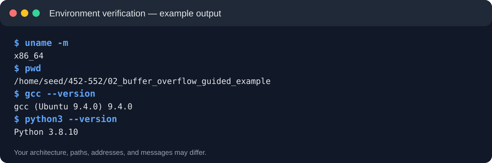
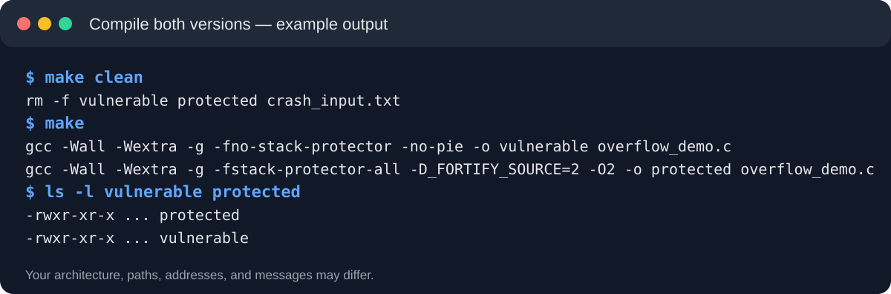
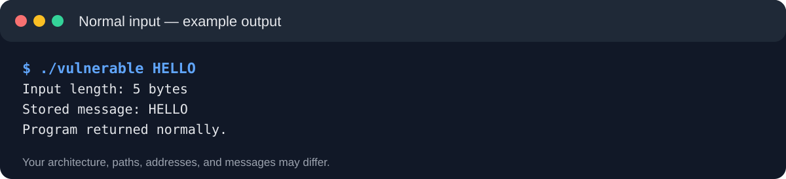
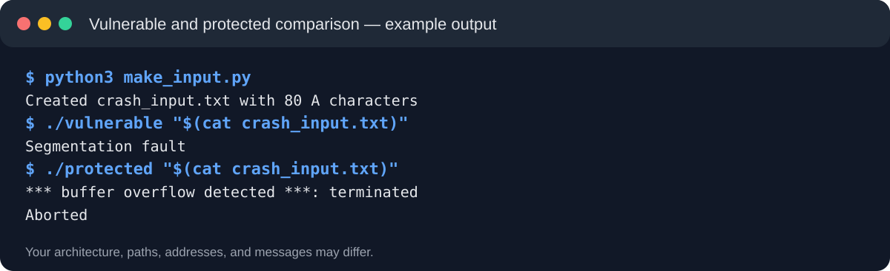
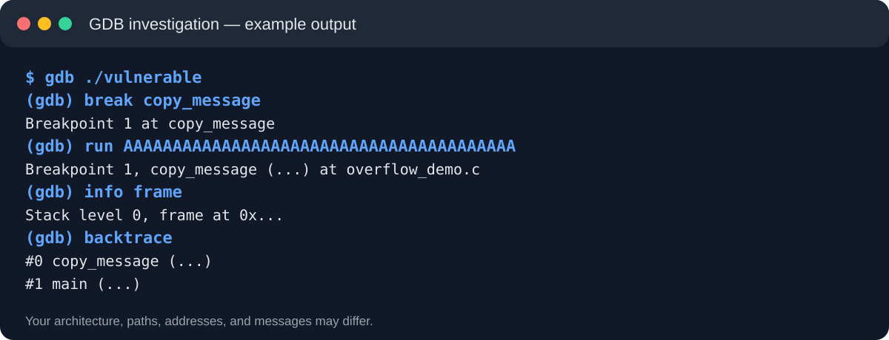

# Guided Buffer Overflow Example

This classroom example prepares students for the SEED Buffer Overflow Lab. It demonstrates the underlying failure without reproducing the graded exploit or providing the assignment's payload values.

## Boundaries

Run every command inside an isolated Linux virtual machine. This example does not create a Set-UID binary, launch shellcode, or grant elevated privileges.

## Learning goals

After the example, you should be able to:

1. Identify the fixed-size buffer and unsafe copy operation.
2. Compare normal input with oversized input.
3. Observe the failure in GDB.
4. Explain how StackGuard changes program behavior.
5. Connect the demonstration to the SEED lab's stack and control-flow concepts.

## Files

| File | Purpose |
| --- | --- |
| `overflow_demo.c` | Small C program containing an unchecked `strcpy()` |
| `Makefile` | Builds an unprotected and protected version |
| `make_input.py` | Generates controlled oversized input |
| `REPORT_TEMPLATE.md` | Example documentation structure |

## Step 1: Open a terminal inside the VM

Verify the environment:

```bash
uname -m
pwd
gcc --version
gdb --version
python3 --version
```

If GCC or GDB is missing:

```bash
sudo apt update
sudo apt install -y build-essential gdb python3
```

## Step 2: Enter this folder

From the cloned course repository:

```bash
cd 452-552/02_buffer_overflow_guided_example
ls -la
```

## Step 3: Read the vulnerable code

```bash
nl -ba overflow_demo.c
```

Find:

```c
char buffer[24];
strcpy(buffer, input);
```

The destination holds 24 bytes. `strcpy()` does not receive the destination size. Longer input overwrites adjacent stack memory.

## Step 4: Build both versions

```bash
make clean
make
file vulnerable protected
```

## Step 5: Test normal input

```bash
./vulnerable HELLO
```

Expected pattern:

```text
Input length: 5 bytes
Stored message: HELLO
Program returned normally.
```

Checkpoint: Explain why five characters fit inside a 24-byte buffer.

## Step 6: Generate oversized input

```bash
python3 make_input.py
wc -c crash_input.txt
./vulnerable "$(cat crash_input.txt)"
```

The exact result varies by architecture and VM. The program might print corrupted output, stop with a segmentation fault, or return abnormally. Record the observed result.

Checkpoint: The 80-byte input exceeds the 24-byte destination by 56 bytes before accounting for the string terminator.

## Step 7: Inspect the failure with GDB

```bash
gdb ./vulnerable
```

At the GDB prompt:

```text
break copy_message
run AAAAAAAAAAAAAAAAAAAAAAAAAAAAAAAAAAAAAAAA
next
info frame
info registers
backtrace
quit
```

Answer:

1. Where did execution stop?
2. Which function owns the local buffer?
3. What does the stack frame contain?
4. Why does changing nearby control data affect execution?

## Step 8: Compare the protected build

```bash
./protected "$(cat crash_input.txt)"
```

Look for a message similar to:

```text
stack smashing detected
```

The protected build places a canary near control data. A changed canary signals an overwrite, so the program stops instead of returning through corrupted control information.

## Step 9: Clean up

```bash
make clean
```

## Visual walkthrough

These images show the expected pattern. Your architecture, paths, memory addresses, and exact messages may differ.

### 1. Verify the Linux VM



### 2. Compile the vulnerable and protected versions



### 3. Establish a normal-input baseline



### 4. Compare overflow behavior



### 5. Inspect the stack frame in GDB



### What to notice

| Screenshot | Evidence to explain |
| --- | --- |
| Environment | Commands run inside Linux, with the correct architecture and tools |
| Build | Compiler flags create separate vulnerable and protected programs |
| Normal input | Five characters fit inside the 24-byte buffer |
| Overflow | The same 80-byte input produces different behavior across builds |
| GDB | The debugger identifies the active function and stack frame |

## What this example does not answer

The SEED assignment still requires students to determine their own architecture-specific values, complete the required SEED tasks, explain exploit decisions, test countermeasures, and submit original screenshots. Memory addresses often differ across environments.

## Instructor pacing for a 20-minute demonstration

| Time | Activity |
| --- | --- |
| 0-3 minutes | Verify VM and tools |
| 3-7 minutes | Read the vulnerable code |
| 7-11 minutes | Compile and run normal input |
| 11-15 minutes | Generate oversized input and observe failure |
| 15-18 minutes | Inspect with GDB |
| 18-20 minutes | Compare the protected build |

## Authorized use

Use this material only in the course VM or another system where you have explicit permission to test.
