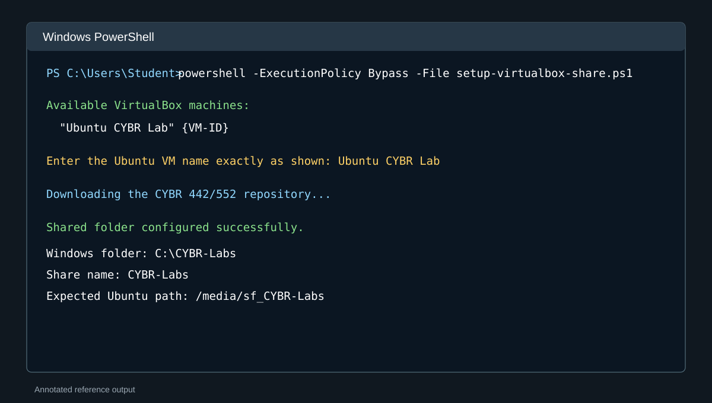
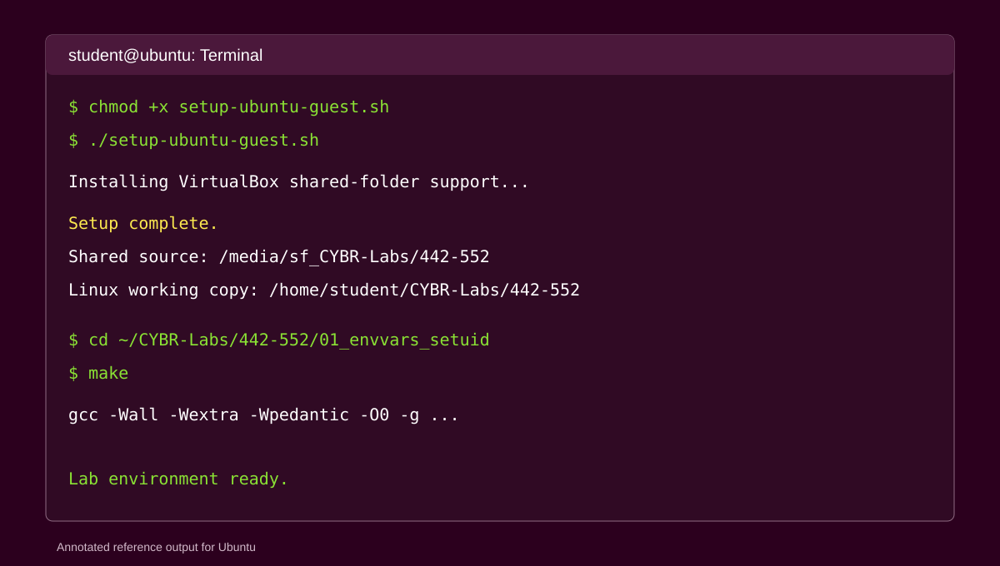
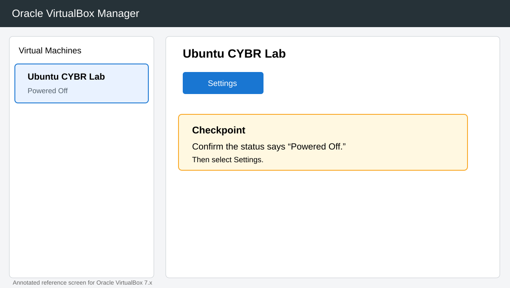
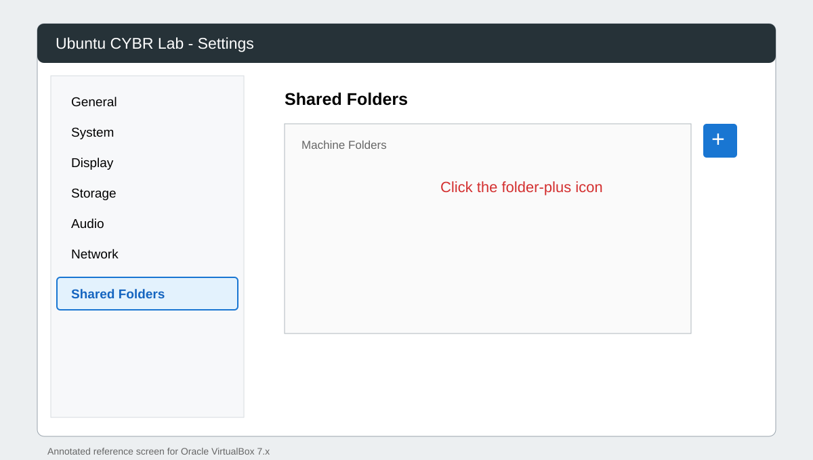
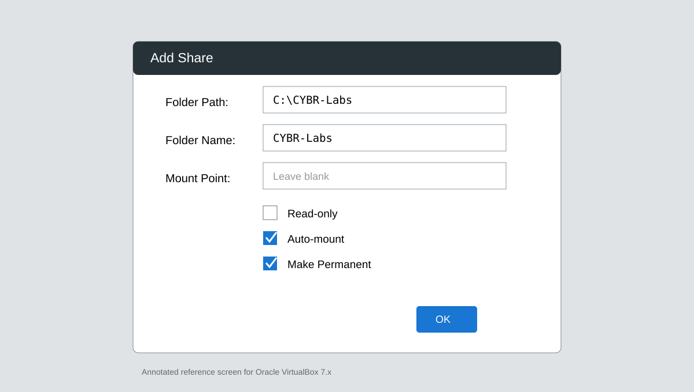

# Oracle VirtualBox Shared Folder Setup

This guide connects a Windows host folder to the Ubuntu course VM. Complete the host step while the VM is powered off, then complete the Ubuntu step inside the VM.

## What the setup creates

- Windows host folder: `C:\CYBR-Labs`
- VirtualBox share name: `CYBR-Labs`
- Automatic Ubuntu mount: `/media/sf_CYBR-Labs`
- Working Linux copy: `~/CYBR-Labs/442-552`

The Set-UID lab must run from the Linux copy under your home directory. VirtualBox shared folders do not preserve every Linux ownership and permission behavior required by this lab.

## Automated setup

### Windows host

1. Power off the Ubuntu VM.
2. Download `setup-virtualbox-share.ps1` from this folder.
3. Open PowerShell as your normal Windows user.
4. Run:

```powershell
powershell -ExecutionPolicy Bypass -File .\setup-virtualbox-share.ps1
```

5. Select the VM when prompted.
6. Start the Ubuntu VM.



### Ubuntu guest

Download `setup-ubuntu-guest.sh` inside Ubuntu, then run:

```bash
chmod +x setup-ubuntu-guest.sh
./setup-ubuntu-guest.sh
```



## Graphical setup

### 1. Power off the VM

The VM status must show `Powered Off`.



### 2. Open Shared Folders

Select the VM, click `Settings`, then select `Shared Folders`.



### 3. Add the host folder

Click the folder-plus icon and enter:

- Folder Path: `C:\CYBR-Labs`
- Folder Name: `CYBR-Labs`
- Read-only: Off
- Auto-mount: On
- Make Permanent: On
- Mount Point: Leave blank



### 4. Prepare Ubuntu

```bash
sudo apt update
sudo apt install -y virtualbox-guest-utils virtualbox-guest-x11
sudo usermod -aG vboxsf "$USER"
sudo reboot
```

After restarting:

```bash
ls -la /media/sf_CYBR-Labs
mkdir -p ~/CYBR-Labs
cp -a /media/sf_CYBR-Labs/442-552 ~/CYBR-Labs/
cd ~/CYBR-Labs/442-552/01_envvars_setuid
make
```

## Verification

```bash
mount | grep vboxsf
groups
test -d /media/sf_CYBR-Labs && echo "Shared folder found"
test -d ~/CYBR-Labs/442-552/01_envvars_setuid && echo "Linux lab copy found"
```

## Common problems

### Permission denied

```bash
sudo usermod -aG vboxsf "$USER"
sudo reboot
```

### Shared folder missing

Confirm `Auto-mount`, `Make Permanent`, and the exact share name `CYBR-Labs`. Then run:

```bash
sudo modprobe vboxsf
sudo mkdir -p /mnt/cybr-labs
sudo mount -t vboxsf CYBR-Labs /mnt/cybr-labs
```

### Unknown filesystem type vboxsf

```bash
sudo apt update
sudo apt install -y virtualbox-guest-utils virtualbox-guest-x11
sudo reboot
```

## Official reference

https://docs.oracle.com/en/virtualization/virtualbox/7.2/user/guestadditions.html#shared-folders
